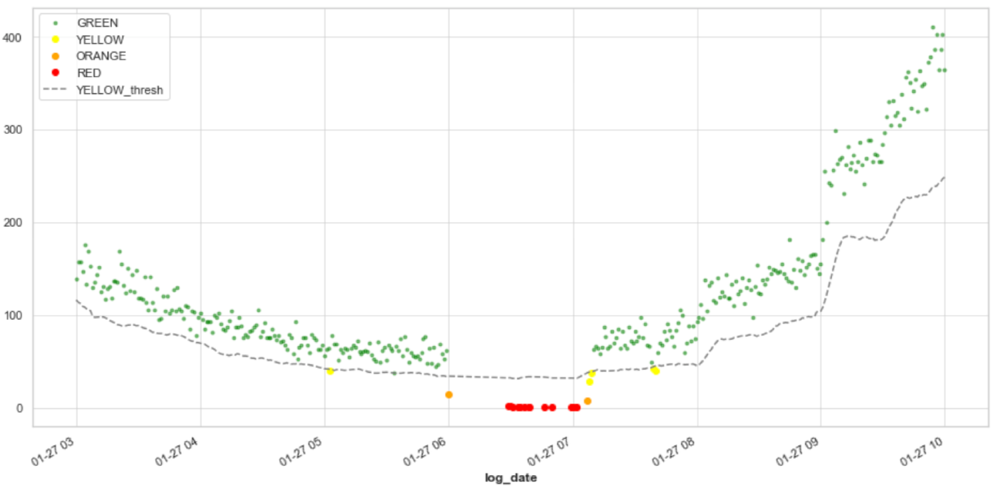
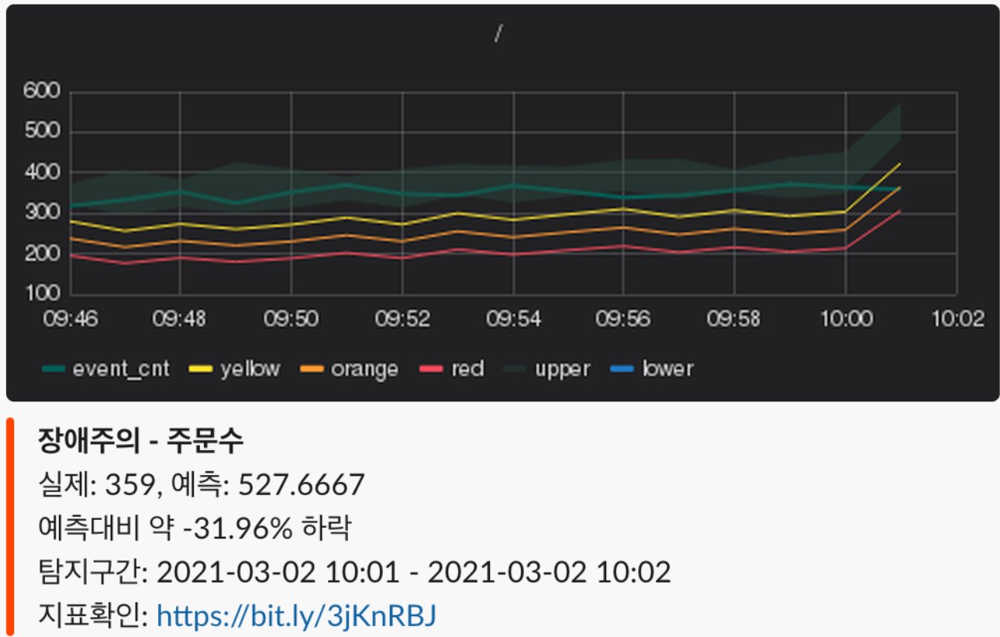

# Anomaly Detection in Transactional Data

This project focused on developing an integrated system to detect anomalies in transactional data for a food delivery service. The goal was to enhance the reliability of operations by promptly identifying and addressing system errors or failures.

## Project Overview

- **Duration**: 1+ years
- **Role**: As the sole data scientist on this project, I was responsible for all aspects of the data science work, from problem formulation and data analysis to model development and implementation. I worked closely with cross-functional teams to ensure the system met operational needs and integrated smoothly with existing infrastructure.

## Problem Statement and Project Planning

In the dynamic environment of food delivery services, rapid detection of system anomalies is crucial for maintaining operational efficiency and service quality. The task was to create a robust system capable of real-time anomaly detection across various transactional data points.

Key aspects of the problem definition and planning phase included:

1. **Stakeholder Collaboration**: Extensive discussions with operations teams to understand critical system components and potential failure points.

2. **Requirement Gathering**: Precisely identifying detection requirements and alert priorities for different types of anomalies.

3. **Metric Definition**: Working with stakeholders to define appropriate success metrics and evaluation criteria for the anomaly detection system.

4. **Challenge Identification**: Recognizing key challenges such as real-time processing, false positive minimization, and scalability requirements.

## Data Analysis and Feature Engineering

My primary responsibilities in this phase included:

1. **Data Ingestion**: Designed a system to collect minutely transactional data from various sources, including order creation, payment, and cancellations.

2. **Data Preparation**: Implemented data cleaning and normalization processes:
   - Handled missing values and removed outliers to ensure consistency in the detection process
   - Developed robust data validation checks to maintain data quality

3. **Feature Engineering**: Developing relevant features for anomaly detection:
   - Created time-based features to capture temporal patterns
   - Engineered aggregate features to represent system-wide behavior
   - Developed service-specific features based on domain knowledge

4. **Real-Time Processing**: Designed a system capable of processing and analyzing data in real-time to enable immediate anomaly detection.

5. **Cross-Functional Collaboration**: Maintained ongoing communication with various stakeholders:
   - Collaborated with operations teams to understand critical business processes
   - Partnered with the data infrastructure team to ensure real-time data availability
   - Engaged with engineering teams on technical implementation feasibility

## Model Development

The modeling approach was tailored to the specific requirements of real-time anomaly detection:

1. **Time Series Analysis**: 
   - Utilized traditional time series models and tools like Facebook Prophet for exploratory data analysis.
   - Examined seasonal patterns, trends, and other temporal characteristics to inform feature engineering and model design.

2. **Multi-Level Threshold System**:
   
   *Multi-level threshold system showing different severity levels (Green: Normal, Yellow: Warning, Orange: Alert, Red: Critical)*
   
   - Implemented a color-coded threshold system for different severity levels
   - Developed dynamic thresholds that adapt to historical patterns
   - Created buffer zones between threshold levels to prevent alert flooding

3. **Alert System Integration**:
   
   *Real-time Slack notifications with severity levels and relevant metrics*
   
   - Designed an automated alert system integrated with Slack
   - Included relevant context and metrics in alerts
   - Color-coded messages based on severity level
   - Provided direct links to monitoring dashboards

4. **Statistical Forecasting**: Analyzed data distribution over time to identify normal patterns and set thresholds for anomaly detection.
   - Utilized Interquartile Range (IQR) to calculate upper and lower bounds
   - Implemented moving average smoothing for threshold stability

5. **Grading System**: Developed a mechanism to categorize the severity of deviations from expected patterns.
  
6. **Model Optimization**: 
   - Experimented with various approaches to balance detection accuracy and real-time performance.

7. **Custom Metrics**: 
   - Developed business-specific metrics alongside traditional statistical measures.

8. **Interpretability**: 
   - Focused on creating models that facilitate quick understanding and action.

## System Implementation and Monitoring

Key aspects of the implementation and monitoring phase included:

1. **Real-Time Alert System**: Implemented a system for instant alerts based on the severity of detected anomalies.

2. **Data Visualization**: Developed dashboards and visualizations to help stakeholders understand the underlying causes of detected anomalies.

3. **Performance Monitoring**: Created a system to continuously monitor the performance of the anomaly detection models.

4. **Iterative Improvement**: Established a feedback loop with operations teams to continuously refine and improve the detection system.

5. **Scalability**: Designed the system with scalability in mind, allowing it to adapt to different types of transactional data and expand to other services.

## Results and Impact

- Significantly improved response times to potential issues, reducing downtime and optimizing operational efficiency.
- Enhanced the reliability and stability of the delivery service's operations through proactive anomaly identification.
- Developed a scalable system capable of adapting to different types of transactional data and expanding to other services within the company.
- Created a framework for continuous system improvement and adaptation to new types of anomalies.

This project demonstrated my ability to develop and implement complex, real-time data analysis systems that directly impact core business operations. It showcased my skills in statistical modeling, real-time data processing, and aligning data science solutions with critical operational needs.

[Back to Home](../index.md)